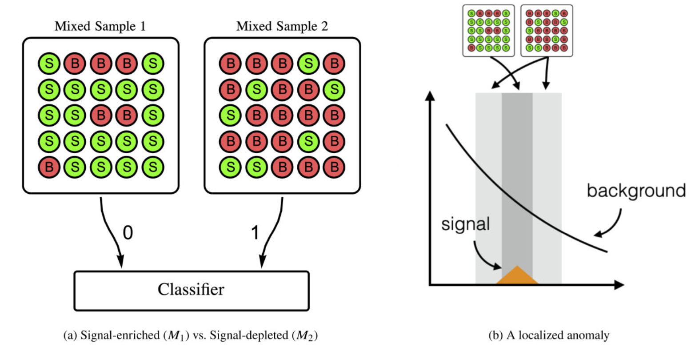
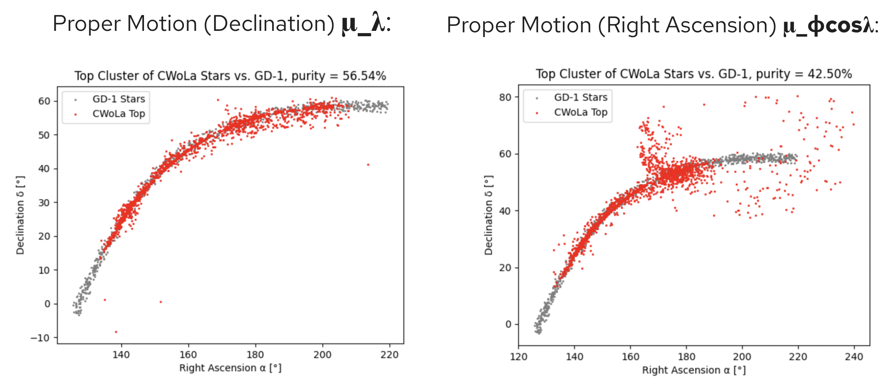

# CWoLa detects stellar streams with coordinate-dependent anomaly detection

The machine learning technique Classification Without Lables evidences the power of anomaly detection in potentially unlabled class mixtures. Following its [original development](https://link.springer.com/article/10.1007/JHEP10%282017%29174) in 2017 for application to the Large Hadron Collider, Dr. Mariel Pettee and her team produced the [first application of CWoLa to astronomical data](https://academic.oup.com/mnras/article/527/3/8459/7452899) in 2023 for the detection of stellar streams. Under her supervision, I explored the scientific reproducibility of their results and the impact of coordinate choice on the performence of CWoLa for anomaly detection.

### Why stellar streams?

Stellar streams are long ribbon-like star formations that are formed from dwarf galaxies and globular clusters, whose gravitational bindings are broken apart by tidal disruptions of a host galaxy during orbit. These streams are increasingly sought for discovery as studies help reveal further illustration of the formation of galaxies, the gravitational potential of the host galaxy, and the distribution of dark matter in the universe. Because the constituent stars of a stream are of the same progenitor, a dwarf galaxy or globular gluster, detection of stellar streams can focus on grouping their similar characteristics. One important characteristic of stellar streams is that they are kinematically cold, which means that the stars have very similar proper motions.  The localization of proper motion for stellar streams justifies the understanding of a stellar stream as an anomaly, with overdense concentration of stream stars compared to background stars in proper motion space. The dense, kinematically cold, Milky Way stellar stream GD-1 is used again here for evaluation.

### How do we detect stellar streams with CWoLa?

CWoLa is a technique for a binary classifier, which takes in two mixed samples of data and learns to distinguish individual events as likely to have come from mixed sample 1 or mixed sample 2. All events within the signal-enriched sample are assigned a proxy label of signal, while all events within the signal-depleted sample are assigned a proxy label of background. After labeling, the CWoLa paradigm involves training fully supervised classifiers to distinguish events from the two regions. Despite not seeing the true signal/background event labels, this classification between mixed samples is proven to be equivalent to the optimal classifier for distinguishing signal and background events. The model returns a value between 0 and 1 that represents how likely the event is to be from the signal region. To determine anomalies, a cut is made on the dataset ordered by highest to lowest anomaly score to select a sample with the highest ratio of signal to noise. When applied to stellar stream detection, the signal and sideband regions are constructed relative to the distribution of the localized proper motion coordinate of stream stars within each data patch (21 circular regions completely overlapping the known GD-1 stream). The exact proprtions of stream to background stars are not required for CWoLa; the only expectation is that there is a higher proportion of stream to background stars within the signal region, with statistically identical events across both regions. This requirement is achieved by defining the signal region as ±1σ away and the sideband region as from ±1σ to ±3σ away from the median proper motion of stream stars within the data patch. 

*Figure 1 : The CWoLa framework is illustrated above. Classification between the mixed samples is equivalent to the optimal classifier for distinguishing between signal and background events, thanks to the [Neyman-Pearson lemma](https://royalsocietypublishing.org/rsta/article/231/694-706/289/40532/IX-On-the-problem-of-the-most-efficient-tests-of) The graph on the right shows the definition of the signal and sideband regions over a localized feature such that the signal region contains more signal events, indicating the localized anomaly. Image: [Original Astro-CWola paper](https://academic.oup.com/mnras/article/527/3/8459/7452899)*

### How does coordinate choice affect CWoLa performance?

The CWoLa paradigm for stellar streams uses the proper motion-defined signal and sideband regions to distinguish between stellar streams stars and background stars, with inputs as their other uncorrelated characteristics. This definition of signal and sideband regions directly affects the events and patterns that the model sees. Therefore, the model’s degree of classification of a star as anomalous or not is dependent on the coordinates given. Importantly, the stellar data used contains two position coordinates λ and ϕ (declination and right ascension), two photometric features b-r and g (color and magnitude), and two proper motion coordinates μ_λ and μ_ϕcosλ (declination and right ascension). The original paper utilized μ_λ to define the signal and sideband search regions for training. Based on the model's classification relying on this coordinate, the question arises: what would happen if the regions were to be defined with the proper motion coordinate? In principle, stellar streams are localized in both proper motion coordinates, and therefore the results should hold if the coordinate were to be switched. This was tested that by defining a new signal and sideband region within each patch of data based on the distribution of μ_ϕcosλ and retraining the model. CWoLa performance is evaluated in terms of purity, which represents the percentage of stars in the top ranked CWoLa stars that are true members of the GD-1 stream.

### How did the model perform with the new region-defining parameter μ_ϕcosλ compared to the original μ_λ?

*Figure 2 : Above are the top 250 CWoLa-ranked stars with the highest anomaly scores from each of the 21 patches, plotted over the GD-1 stream. The left plot shows the scan over proper motion in the declination direction, μ_λ, and the right plot shows the scan over proper motion in the right ascension direction, μ_ϕcosλ. *

As seen above, the middle, denser parts of the stream were identified correctly with both coordinates. Concurrently, CWoLa's performance drops significantly when labeling the end regions of the stream correctly. This is expected, however, because at the end of the GD-1 stream, stream stars are less densely populated and less localized in proper motion space, causing the stream stars to appear very similar to the background stars. 

The end regions of the stream are largely covered by patches 2, 6, 13, and 18. Through two runs of CWoLa on each proper motion coordinate, a 0% purity was achieved for both, showing that at least CWoLa is failing consistently. 

Between the two proper motion coordinate runs, 11 patches had even scores (within a 5% purity of one another). Only 2 patches resulted in a higher purity score for the mu_phi cos lambda coordinate, while 8 patches had a higher purity score for the mu_lambda coordinate. Among those were patches 7 and 14, which had 0% purity for the mu_phi cos lambda coordinate on the right, but 45% and 67% respectively for the mu_lambda coordinate. This supports the idea that even though both proper motion coordinates are localized, there are varying degrees of localization across the patches, which motivates a closer patch-by-patch analysis for the right choice in proper motion coordinates. 

It’s also worth noting that based on the distributions of the data and the region definitions, there were a higher number of background stars in the signal and sideband regions for the mu_phi cos lambda coordinate compared to mu_lambda, which indicates a lower stream signal ratio to begin with and a harder dataset for CWoLa to correctly distinguish. To better understand that, I looked into the ratio of signal to background stars in both the signal and sideband regions.

full results (reproduced purity, differences with other parameter) with ratios -- plot

future study, optimization

